# 🌐 Muffeia - Community Problem-Sharing Platform

> **A modern, secure community platform where people share their problems and find solutions together.**

<p align="center">
  
</p>

---

## 📋 Table of Contents

- [Overview](#overview)
- [Key Features](#key-features)
- [Technology Stack](#technology-stack)
- [Project Structure](#project-structure)
- [Installation Guide](#installation-guide)
- [Configuration](#configuration)
- [Usage](#usage)
- [API Endpoints](#api-endpoints)
- [Security](#security)
- [Deployment](#deployment)
- [Contributing](#contributing)
- [License](#license)
- [Support](#support)

---

## 🎯 Overview

**Muffeia** is a sophisticated, full-stack web application designed to foster a safe and inclusive community where individuals can:

- **Post problems** they're facing (personal, technical, educational, etc.)
- **Receive solutions** from community members with relevant expertise
- **Engage with peers** through discussions, comments, and direct messaging
- **Build reputation** through helpful contributions and community recognition
- **Discover content** via categories, tags, and advanced search functionality
- **Participate anonymously** for sensitive topics or openly to build personal brand

### Vision

To create a **safer alternative to traditional Q&A and support platforms** by emphasizing:
- 🔒 **Privacy**: End-to-end encrypted direct messaging
- 👥 **Community**: Gamified reputation system and public recognition
- 🛡️ **Safety**: Intelligent content moderation and community guidelines
- 🌍 **Inclusivity**: Multi-language support with UTF-8MB4 encoding

---

## ✨ Key Features

<p align="center">
  
</p>

### Core Features

#### 👤 User Management
- **Multi-authentication methods**: Email/Password, Google OAuth, Facebook OAuth
- **Email verification** with secure token system
- **User profiles** with statistics and contribution history
- **Account management** including secure deletion workflows
- **Online status** and presence tracking

#### 📝 Content Management
- **Post problems** with categories, tags, and descriptions
- **Submit solutions** with community voting
- **Accept best solution** feature to mark definitive answers
- **Edit & delete** your own content
- **Bookmarking** for saving posts to read later
- **View analytics** (likes, views, reply count)

#### 💬 Community Engagement
- **Direct messaging** with end-to-end encryption (AES-256-CBC)
- **Group chat rooms** for community discussions
- **Real-time notifications** for replies, messages, and mentions
- **Like/unlike** problems and solutions
- **Reputation system** with badges and recognition
- **Leaderboard** showcasing top contributors
- **Follow categories and tags** for personalized feed

#### 🛡️ Content Moderation
- **Intelligent bad word filtering** (1,360+ moderated terms)
- **Obfuscation detection** to prevent filter bypass
- **Report inappropriate content** with admin review
- **Text masking** for profanity
- **Spam detection** via rate limiting
- **Admin moderation dashboard**

#### 🔍 Discovery & Search
- **Full-text search** across users and posts
- **Category browsing** with hierarchical organization
- **Tag exploration** and trending tags
- **Advanced search filters** by date, popularity, solved status
- **Pagination** for efficient data loading
- **SEO-optimized** with sitemap and robots.txt

#### 🔒 Security Features
- **Password hashing** with bcrypt
- **CSRF protection** on all forms
- **SQL injection prevention** via prepared statements
- **XSS protection** through HTML escaping
- **Rate limiting** (120 requests/minute per IP)
- **AES-256-CBC encryption** for private messages
- **Email verification tokens**
- **Secure session management**

---

## 🛠️ Technology Stack

<p align="center">
  
</p>

### Dependencies

| Package | Purpose | Version |
|---------|---------|---------|
| `phpmailer/phpmailer` | Email delivery | ^7.0 |
| `league/oauth2-facebook` | Facebook authentication | ^2.2 |
| `league/oauth2-google` | Google authentication | ^5.0 |
| `guzzlehttp/guzzle` | HTTP client | (transitive) |

---

## 📁 Project Structure

```
muffeia/
├── 📄 index.php                    # Main dashboard (authenticated users)
├── 📄 landing.php                  # Public landing page
├── 📄 post_problem.php             # Problem submission
├── 📄 submit_solution.php          # Solution submission
│
├── 📁 api/                         # AJAX Endpoints (20+ files)
│   ├── load_posts.php              # Paginated posts
│   ├── load_messages.php           # Message fetching
│   ├── post_message.php            # Send encrypted message
│   ├── bookmark_post.php           # Save posts
│   ├── report_post.php             # Flag content
│   └── ... (15+ more endpoints)
│
├── 📁 auth/                        # Authentication (6 files)
│   ├── login.php                   # Login interface
│   ├── api.php                     # OAuth & login endpoint
│   ├── logout.php                  # Logout
│   └── forgot_password.php         # Password reset
│
├── 📁 pages/                       # Page Views (17 files)
│   ├── admin_dashboard.php         # Admin panel
│   ├── view_problem.php            # Problem detail
│   ├── profile.php                 # User profile
│   ├── message.php                 # Direct messaging
│   └── ... (13+ more pages)
│
├── 📁 includes/                    # Core Libraries (18 files)
│   ├── config.php                  # Database credentials ⚠️ (ignored)
│   ├── db.php                      # Connection & init
│   ├── moderation.php              # Content filtering
│   ├── encryption.php              # AES-256-CBC
│   ├── reputation.php              # Points & badges
│   └── ... (13+ more libraries)
│
├── 📁 js/                          # JavaScript (9 files)
│   ├── scripts.js                  # Main logic
│   ├── notifications.js            # Real-time updates
│   └── ... (7+ more scripts)
│
├── 📁 css/                         # Stylesheets (13 files)
│   ├── muffeia-ui.css              # Main styles
│   ├── responsive.css              # Mobile styles
│   └── ... (11+ more stylesheets)
│
├── 📁 community/                   # Static Pages (5 files)
│   ├── about.php
│   ├── guidelines.php
│   ├── privacy.php
│   └── contact.php
│
├── 📁 uploads/                     # User-Generated Files
├── 📁 vendor/                      # Composer Dependencies
│
├── .gitignore                      # Sensitive files to ignore
├── .htaccess                       # Apache configuration
├── robots.txt                      # SEO configuration
├── composer.json                   # PHP dependencies
└── composer.lock                   # Locked versions
```

**Statistics:**
- Total PHP files: 299
- JavaScript files: 9
- CSS files: 13
- Total project size: 19MB

---

## 🚀 Installation Guide

### Prerequisites

Before you begin, ensure you have:

- **PHP 7.0+** with these extensions:
  - `mysqli` (MySQL connection)
  - `openssl` (encryption)
  - `json` (data handling)
  - `spl` (libraries)
- **MySQL 5.7+** or **MariaDB 10.2+**
- **Apache** with `mod_rewrite` enabled
- **Composer** (for dependency management)
- **Git** (for version control)

### Step 1: Clone the Repository

```bash
git clone https://github.com/yourusername/muffeia.git
cd muffeia
```

### Step 2: Install Dependencies

```bash
composer install
```

This will install:
- `phpmailer/phpmailer` - Email functionality
- `league/oauth2-facebook` - Facebook authentication
- `league/oauth2-google` - Google authentication

### Step 3: Environment Configuration

**Create a `.env` file** (never commit this):

```bash
cp .env.example .env
```

**Edit `.env` with your credentials:**

```env
# Database Configuration
DB_HOST=your_db_host
DB_USER=your_db_user
DB_PASS=your_db_password
DB_NAME=your_db_name

# Application Settings
APP_URL=http://localhost:8000
APP_TIMEZONE=Asia/Manila
APP_ENV=development

# Email Configuration (SMTP)
MAIL_HOST=smtp.gmail.com
MAIL_PORT=587
MAIL_USER=your_email@gmail.com
MAIL_PASS=your_app_password

# OAuth Credentials
GOOGLE_CLIENT_ID=your_google_client_id
GOOGLE_CLIENT_SECRET=your_google_client_secret
FACEBOOK_CLIENT_ID=your_facebook_app_id
FACEBOOK_CLIENT_SECRET=your_facebook_app_secret
```

> ⚠️ **Important**: Never commit `.env` file. It's included in `.gitignore`.

### Step 4: Set Up Database

**Option A: Using Migration Script (Recommended)**

```bash
# Start local server
php -S localhost:8000

# Visit in browser
http://localhost:8000/migrate.php
```

**Option B: Manual SQL Import**

```bash
mysql -h your_host -u your_user -p your_database < database/schema.sql
```

### Step 5: Configure Admin User

```sql
-- Set existing user as admin
UPDATE users SET is_admin = TRUE 
WHERE email = 'your_email@example.com';
```

### Step 6: Start Development Server

```bash
php -S localhost:8000
```

Visit `http://localhost:8000` in your browser.

### Step 7: Verify Installation

- [ ] Home page loads (landing.php for guests)
- [ ] Registration works
- [ ] Email verification sends
- [ ] Login succeeds
- [ ] Can post problems
- [ ] Can submit solutions
- [ ] Dark mode toggle works
- [ ] Admin dashboard accessible

---

## ⚙️ Configuration

### Database Configuration

Edit `.env` file:

```env
DB_HOST=localhost
DB_USER=root
DB_PASS=your_secure_password
DB_NAME=muffeia
```

### Email Configuration

Configure SMTP in `.env`:

```env
MAIL_HOST=smtp.gmail.com
MAIL_PORT=587
MAIL_USER=your_email@gmail.com
MAIL_PASS=your_app_password
```

### OAuth Configuration

Set up credentials in `.env`:

```env
GOOGLE_CLIENT_ID=your_client_id.apps.googleusercontent.com
GOOGLE_CLIENT_SECRET=your_client_secret
FACEBOOK_CLIENT_ID=your_facebook_app_id
FACEBOOK_CLIENT_SECRET=your_facebook_app_secret
```

### Rate Limiting

Adjust in `includes/rate_limiter.php`:

```php
define('RATE_LIMIT_REQUESTS', 120);     // Requests
define('RATE_LIMIT_WINDOW', 60);        // Time window (seconds)
```

---

## 📖 Usage

### For Users

#### Creating an Account

1. Visit the landing page
2. Click "Sign Up"
3. Choose authentication method:
   - Email & Password (verify email)
   - Google OAuth
   - Facebook OAuth
4. Complete your profile

#### Posting a Problem

1. Click "Post a Problem"
2. Fill in:
   - **Title**: Clear, descriptive heading
   - **Description**: Detailed explanation
   - **Category**: Select relevant category
   - **Tags**: Add 1-5 tags
3. Click "Submit"

#### Finding Solutions

1. Browse categories or use search
2. Click on a problem to view details
3. Read solutions from community members
4. Accept the best solution (if problem owner)
5. Bookmark for later reference

#### Direct Messaging

1. Visit a user's profile
2. Click "Message"
3. Send encrypted message
4. All messages are end-to-end encrypted

### For Administrators

#### Access Admin Dashboard

1. Log in with admin account
2. Navigate to `/pages/admin_dashboard.php`

#### Moderate Content

- Review reported posts
- Remove inappropriate content
- Suspend/ban users if needed
- Manage categories and tags

---

## 🔌 API Endpoints

All API endpoints use **POST** requests with **CSRF tokens** and return **JSON**.

### Authentication

| Endpoint | Purpose |
|----------|---------|
| `POST /auth/api.php` | Login/OAuth handler |
| `POST /auth/logout.php` | Logout user |
| `POST /auth/forgot_password.php` | Request password reset |
| `POST /auth/reset_password.php` | Reset password with token |

### Posts

| Endpoint | Purpose |
|----------|---------|
| `POST /api/load_posts.php` | Fetch paginated posts |
| `POST /api/check_new_posts.php` | Check for new content |
| `POST /api/bookmark_post.php` | Toggle bookmark |
| `POST /api/report_post.php` | Report inappropriate content |
| `POST /api/delete_post.php` | Delete problem |
| `POST /api/accept_solution.php` | Mark best solution |

### Messaging

| Endpoint | Purpose |
|----------|---------|
| `POST /api/load_messages.php` | Fetch conversation |
| `POST /api/post_message.php` | Send encrypted message |
| `POST /api/delete_message.php` | Delete message |
| `POST /api/get_message_count.php` | Unread count |

### Notifications

| Endpoint | Purpose |
|----------|---------|
| `POST /api/check_notifications.php` | Fetch notifications |
| `POST /api/get_notification_count.php` | Unread count |
| `POST /api/delete_notification.php` | Mark as read |
| `POST /api/clear_all_notifications.php` | Clear all |

### Users

| Endpoint | Purpose |
|----------|---------|
| `POST /api/update_online_status.php` | Set presence |
| `POST /api/delete_user.php` | Delete account |
| `POST /api/schedule_account_deletion.php` | Request deletion |

### Example API Call

**Fetch Posts:**
```javascript
fetch('/api/load_posts.php', {
  method: 'POST',
  headers: { 'Content-Type': 'application/json' },
  body: JSON.stringify({
    csrf_token: document.querySelector('[name="csrf_token"]').value,
    page: 1,
    category: 'technology'
  })
})
.then(r => r.json())
.then(data => console.log(data));
```

---

## 🔐 Security

<p align="center">
  
</p>

### Security Best Practices

#### 1. **Environment Variables**

Never hardcode sensitive data. Use `.env` file:

```bash
# .env (NEVER commit)
DB_HOST=localhost
DB_USER=root
DB_PASS=secure_password
```

#### 2. **Password Security**

```php
// Hash passwords with bcrypt
$hashed = password_hash($password, PASSWORD_DEFAULT);

// Verify password
if (password_verify($input, $hashed)) { /* Login */ }
```

#### 3. **SQL Injection Prevention**

```php
// ✅ GOOD: Prepared statement
$stmt = $conn->prepare("SELECT * FROM users WHERE email = ?");
$stmt->bind_param("s", $email);
$stmt->execute();

// ❌ BAD: Never do this
$query = "SELECT * FROM users WHERE email = '" . $email . "'";
```

#### 4. **XSS Protection**

```php
// ✅ GOOD: HTML escaping
echo htmlspecialchars($user_input, ENT_QUOTES, 'UTF-8');

// ❌ BAD: Unescaped output
echo $user_input;
```

#### 5. **CSRF Protection**

```php
// Generate token
$token = bin2hex(random_bytes(32));
$_SESSION['csrf_token'] = $token;

// Validate on submit
if ($_POST['csrf_token'] !== $_SESSION['csrf_token']) {
    die('CSRF token invalid');
}
```

#### 6. **Message Encryption**

```php
// Encrypt with AES-256-CBC
$encrypted = openssl_encrypt($message, 'AES-256-CBC', $key, 0, $iv);

// Decrypt
$decrypted = openssl_decrypt($encrypted, 'AES-256-CBC', $key, 0, $iv);
```

#### 7. **Rate Limiting**

```php
// Check limit
if (isRateLimited($ip)) {
    http_response_code(429);
    die('Too many requests');
}

// Track request
recordRequest($ip);
```

#### 8. **Content Moderation**

```php
// Automatic filtering
if (containsModeratedContent($text)) {
    $text = maskProfanity($text);  // Mask as **
}
```

### Security Checklist

- [ ] `.env` file created and added to `.gitignore`
- [ ] All database credentials in `.env` (not in code)
- [ ] `includes/config.php` added to `.gitignore`
- [ ] HTTPS enabled in production
- [ ] HTTPS redirect in `.htaccess`
- [ ] OAuth credentials stored in `.env`
- [ ] SMTP password stored in `.env`
- [ ] File permissions: `chmod 600` for config files
- [ ] Regular backups implemented
- [ ] SQL backups encrypted and stored securely
- [ ] Error logging to file (not displayed to users)
- [ ] Update PHP and MySQL regularly

---

## 🌍 Deployment

### Hosting Options

#### Option 1: Shared Hosting (e.g., InfinityFree, Bluehost)

1. **Upload files via FTP/SFTP**
   ```bash
   sftp user@host.com
   put -r muffeia/* /public_html/
   ```

2. **Create database via control panel**
   - cPanel or Plesk
   - Run migrations

3. **Configure `.env` for production**
   - Set production database credentials
   - Set production SMTP credentials

4. **Enable HTTPS**
   - Use Let's Encrypt (free)

### Option 2: VPS (e.g., DigitalOcean, Linode)

1. **Install LEMP Stack**
   ```bash
   sudo apt update
   sudo apt install php php-cli php-fpm php-mysql nginx mysql-server
   ```

2. **Clone repository**
   ```bash
   git clone https://github.com/yourusername/muffeia.git
   cd muffeia
   composer install
   ```

3. **Set SSL with Certbot**
   ```bash
   sudo apt install certbot python3-certbot-nginx
   sudo certbot --nginx -d muffeia.com
   ```

### Option 3: Docker

**Dockerfile:**
```dockerfile
FROM php:7.4-apache
RUN docker-php-ext-install mysqli pdo pdo_mysql
RUN a2enmod rewrite
COPY . /var/www/html/
```

**docker-compose.yml:**
```yaml
version: '3'
services:
  web:
    build: .
    ports:
      - "80:80"
  db:
    image: mysql:5.7
    environment:
      MYSQL_DATABASE: muffeia
      MYSQL_ROOT_PASSWORD: password
```

### Pre-Deployment Checklist

- [ ] All environment variables in `.env`
- [ ] Database backed up
- [ ] HTTPS certificate installed
- [ ] `.htaccess` configured for production
- [ ] Error logs set to private location
- [ ] Admin account created
- [ ] Email testing successful
- [ ] OAuth apps configured
- [ ] Rate limiting configured
- [ ] Backup schedule set up
- [ ] Monitoring enabled
- [ ] Performance optimized

---

## 👥 Contributing

We welcome contributions! Here's how to get started.

### Code of Conduct

- Be respectful and inclusive
- Report issues responsibly
- Follow the project's code style
- Write clear commit messages

### Development Workflow

1. **Fork the repository**
   ```bash
   git clone https://github.com/yourusername/muffeia.git
   ```

2. **Create a feature branch**
   ```bash
   git checkout -b feature/amazing-feature
   ```

3. **Make your changes**
   - Write clean, documented code
   - Follow PSR-12 PHP coding standards
   - Add comments for complex logic

4. **Test your changes**
   - Test in browser
   - Test across devices (mobile, tablet, desktop)
   - Test in light and dark mode

5. **Commit and push**
   ```bash
   git add .
   git commit -m "Add amazing feature"
   git push origin feature/amazing-feature
   ```

6. **Open a Pull Request**
   - Describe changes clearly
   - Link related issues
   - Wait for review

### Reporting Bugs

Open an issue with:
- Clear title
- Detailed description
- Steps to reproduce
- Expected vs actual behavior
- Screenshots if applicable
- Your environment (OS, browser, PHP version)

### Suggesting Features

Describe:
- Use case
- Expected behavior
- Mockups or wireframes
- Potential implementation approach

---

## 📄 License

This project is licensed under the **MIT License** - see [LICENSE](LICENSE) file for details.

---

## 💬 Support

### Getting Help

- **Documentation**: See [DOCUMENTATION_INDEX.txt](DOCUMENTATION_INDEX.txt)
- **FAQ**: Check existing GitHub issues
- **Email**: support@muffeia.com

### Resources

- [PHP Documentation](https://www.php.net/docs.php)
- [MySQL Documentation](https://dev.mysql.com/doc/)
- [OAuth2 Guide](https://oauth.net/2/)
- [OWASP Security](https://owasp.org/)

### Community

- GitHub Issues for bug reports
- GitHub Discussions for questions
- Contributing guidelines above

---

## 🎉 Built with ❤️ by the Muffeia Community

© 2026 Muffeia. Making communities safer, one problem at a time.

---

**Last Updated**: June 1, 2026  
**Version**: 3.0  
**Status**: Production Ready ✅
